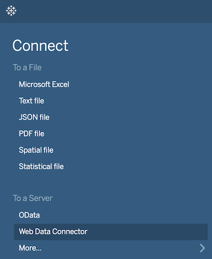
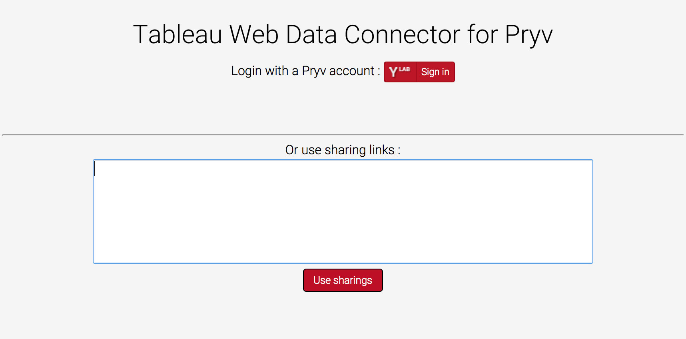
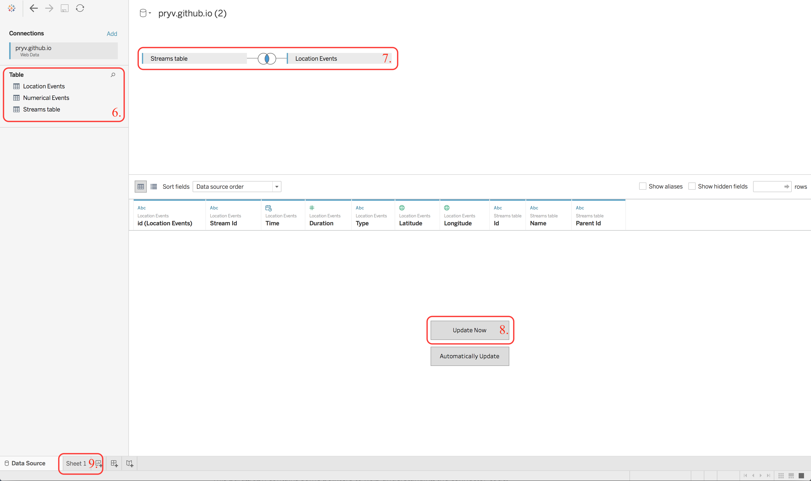

# bridge-tableau

Tableau Web data connector ([WDC](http://tableau.github.io/webdataconnector/docs/)) implementation for Pryv.IO.

The connector uses WDC Version 2.2 and targets Tableau 10.0 and later.

_NOTE: Tableau refers either to [Tableau Desktop](https://www.tableau.com/products/desktop), for which you can have a free 14-day trial or [Tableau Public](https://public.tableau.com/s/), which you can use for free but with restrictions._

## Usage

1. In Tableau, under **Connect/To a Server**, choose **Web Data Connector**.

   

2. A popup opens, paste the following URL and press _Enter_ :

   > https://pryv.github.io/bridge-tableau/

   

3. _(Optional)_ You can adapt the previous URL in order to pass custom settings:

   * If you already have a valid Pryv.IO access (it skips steps 4 and 5) :

     > https://pryv.github.io/bridge-tableau/?username=YOURUSER&auth=YOURTOKEN

   * If you want to change the Pryv.IO domain (default is _pryv.me_) :

     > https://pryv.github.io/bridge-tableau/?domain=YOURDOMAIN

   * Or both :

     > https://pryv.github.io/bridge-tableau/?username=YOURUSER&auth=YOURTOKEN&domain=YOURDOMAIN

4. Use the **Sign in** button to login to your Pryv.IO account and authorize Tableau to access it.

5. Click on **Get last 10'000 Data** to retrieve some of your Pryv.IO data in Tableau.

6. You should now have access to 3 tables in Tableau; **Streams**, **Location Events** and **Numerical Events**.

   

7. Double-click on any of these tables to add them in the schema view, you can also join multiple tables.

8. Click on **Update now** to fill the tables with data.

9. Click the **Sheet** tab to begin your analysis in a new worksheet.

10. Here is some additional links to get started with Tableau:

   * [Get Started with Tableau Desktop](https://onlinehelp.tableau.com/current/guides/get-started-tutorial/en-us/get-started-tutorial-home.html)
   * [Build a Basic View to Explore Your Data](https://onlinehelp.tableau.com/current/pro/desktop/en-us/getstarted_buildmanual_ex1basic.html)

## Contribute

This paragraph contains some pointers to help understanding the connector code,
in case you want to fork it and adapt it to your own needs.

### Tableau part

First of all, we include the [Tableau WDC sdk](https://connectors.tableau.com/libs/tableauwdc-2.2.latest.js) in the **index.html**.

```html
<script src="https://connectors.tableau.com/libs/tableauwdc-2.2.latest.js" type="text/javascript"></script>
```

It gives access to a tableau object, which will be used to define the Tableau logic.

#### Initialization

In **connector.js**, we first instantiate our Tableau connector :

```javascript
var myConnector = tableau.makeConnector();
```

We then define the `myConnector.init` function, which will be called at the start of every Tableau phase (see [Phase 1](#phase-1-authentication) and [Phase 2](#phase-2-data-gathering)). The main tasks of this function is to tell tableau that we want a custom authentication type  (see [Phase 1](#phase-1-authentication)) :

```javascript
tableau.authType = tableau.authTypeEnum.custom;
```

and to save Pryv's credentials in Tableau so that they persist between phases.

Finally, we define the `myConnector.getData/getSchema` functions (see [Phase 2](#phase-2-data-gathering)) and conclude the connector initialization by registering it:

```javascript
tableau.registerConnector(myConnector);
```

#### Phase 1: Authentication

By default, the connector will start with Tableau authentication phase, which will show a popup with a form to provide Tableau credentials.

We have to replace this default authentication phase with Pryv authentication (see [Pryv authentication](#authentication)), by telling Tableau that we want a custom authentication type (as explained in [Initialization](#initialization)) or directly by aborting the current Tableau phase:

```javascript
tableau.abortForAuth();
```

Once authenticated, we show a submit button (declared in **index.html**) that will call Tableau submit function on user click and start the data gathering phase:

```html
<button id="submitButton" onclick="tableau.submit();">Get last 10'000 Data</button>
```

#### Phase 2: Data gathering

In order to complete the configuration of the Tableau connector logic, we have to provide two additional functions that will be called to gather and structure the data, once authentication is sucessful.

##### Schema definition

Firstly, we define our data schema in the `myConnector.getSchema` function, by enumerating the tables in which we will store the data and their corresponding columns.

Tables are simple objects containing an id, an alias and an array of columns :

```javascript
var streamTable = {
	id: "stream",
	alias: "Streams table",
	columns: stream_cols
};
```

A column is defined by an id, an alias, a data type and can optionally specify a foreign key (a relation to another column) :

```javascript
{
	id: "parentId",
	alias: "parentId",
	dataType: tableau.dataTypeEnum.string,
	foreignKey: {tableId: 'stream', columnId: 'id'}
}
```

In our case, the schema contains the following three tables;  **streamTable** for Pryv.IO Streams, **eventNumTable** for Pryv.IO numerical events and **eventLocationTable** : for Pryv.IO location Events.

##### Retrieving the data

Secondly, we define how and where Tableau will retrieve data by implementing the `myConnector.getData` function.

Since this function will be called once for each table of our schema, we have to check the current table id and call the appropriate retrieval method :

```javascript
switch (table.tableInfo.id) {
	case 'stream':
		getStreams(table, doneCallback);
		break;
	case 'eventNum':
		getNumEvents(table, doneCallback);
		break;
	case 'eventLocation':
		getLocationEvents(table, doneCallback);
	break;
}
```

The exact implementation of the retrieval methods will be covered in the Pryv.IO section (see [Pryv data gathering](#data-gathering)).

### Pryv.IO

For Pryv.IO logic, we import our javascript library in the **index.html** :

```html
<script type="text/javascript" src="https://api.pryv.com/lib-javascript/latest/pryv.js"></script>
```

It gives access to a pryv.io object that will be used for authentication/connection to Pryv.IO as well as for some utility functions.

We also add a login button that will allow the user to authenticate with a Pryv.IO account, as well as a logout button :

```html
<!-- It does not look like a button yet, onclick event will be affected to it later. -->
<span id="pryv-button"></span>
<button id="pryv-logout">Logout</button>
```

#### Initialization

In a first step, we configure some settings for Pryv.IO authentication (see [Authorize your app in API reference](http://api.pryv.com/getting-started/javascript/#authorize-your-app)):

* **Domain** corresponding to the Pryv.IO platform on which the user is registered.
* **Id** of the application (connector).
* Array of **Permissions** to be granted to the connector, where each **Permission** indicates:
  * **streamId**: an ids array of Pryv streams that we want to access from Tableau.
  * **level**: the access level we will grant (read/manage/contribute).
* A set of **callbacks** that will be called during the authentication process (see [Pryv.IO authentication](#authentication)).

Finally, the utility function `getSettingsFromURL` loads custom parameters that the user may provide in the connector URL to further configure the Pryv.IO authentication (see [Usage](#usage), step 3).

#### Authentication

As soon as the Tableau connector opens, it will start the Pryv.IO authentication flow by calling `pryvAuthSetup`. Two situations can be observed:

* If the user provided an existing Pryv.IO access through the connector URL (see [Usage](#usage), step 3), it will bypass Pryv authentication and directly jumps to data gathering by calling `tableau.submit`.
* Otherwise, it will call `pryv.Auth.setup(authSettings)`, which will activate the Pryv.IO login button and start the authentication flow using the settings prepared previously.

##### Phase 1: needSignin

The first callback that will trigger is **needSignin**, which indicates that the user did not authorize the Tableau connector to access the Pryv account yet. In this phase, we simply reset the authentication state (`resetAuthState`, in case a previous session still exists) and tell Tableau to abort its current phase for custom authentication (`tableau.abortForAuth`).

From there, the connector will just wait until the user logs in with a Pryv.IO account. On sucessful login, the user will be asked to accept the permissions requested by Tableau.

##### Phase 2: signedIn

Once the user accepts, an access will be granted and it will trigger **the signedIn** callback, which receives the newly opened Pryv.IO connection and shows the Pryv.IO logout button.

Finally, connection to Pryv.IO is cached using  `getPYConnection` function, which serves in fact three roles:

* If a Pryv.IO connection is already open, it stores the corresponding Pryv.IO credentials as Tableau credentials, so that the session persists during phases and navigation in Tableau.
* If Tableau credentials exists but we lost the connection to Pryv:IO, it opens a new Pryv connection using the same credentials.
* Finally, it returns the current Pryv.IO connection.

#### Data gathering

We implemented three functions that define how Tableau will collect data and fill each table we previously declared during [schema definition](#schema-definition).

##### Get Streams

The `getStreams` function uses the current Pryv connection to perform a GET call to Pryv.IO API, on the Streams route, then parse the resulting Streams and append them as rows of the corresponding table (`appendStreams` => `table.appendRows`).

##### Get Location Events

The `getLocationEvents` function relies on the `getEvents` function, which works similarly to `getStreams`, but targets the Events route and provides an additional Pryv.IO filter to limit the results to the last 10'000 Events of type location (_'position/wgs84'_).

Then, as for Streams, we parse the resulting Events and append them as rows of the corresponding table (`appendEvents` => `table.appendRows`).

##### Get Numerical Events

Finally, retrieval of numerical Events through `getNumEvents` function follows the same steps as for location Events with the only difference that we use this time a post-filtering function to limit the resulting Events to numerical measurements:

```javascript
var postFilter = function (event) {
	return (!isNaN(parseFloat(event.content))
		&& isFinite(event.content));
};
```

While Pryv.IO Filters will perform the filtering on the API side, the post-filtering are applied by the connector, after the Events have been retrieved from Pryv. 

## License

[Revised BSD license](https://github.com/pryv/documents/blob/master/license-bsd-revised.md)

Don't hesitate to contribute to this repository. The Pryv.IO user community will be grateful!
